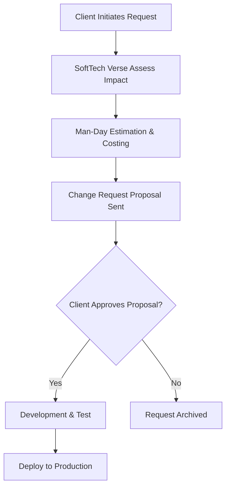

# CHANGE REQUEST POLICY
## REC-DOC-006

---

### PROJECT METADATA
* **Project Name**: Recovera Loan Recovery Management System
* **Client Name**: ACFL Patna
* **Version**: 1.0.0
* **Document No.**: REC-DOC-006
* **Prepared By**: SoftTech Verse
* **Prepared For**: ACFL Patna
* **Date**: 01 August 2026
* **Classification**: Confidential

---

### CONFIDENTIALITY NOTICE
> [!IMPORTANT]
> **CONFIDENTIAL**
> This document contains proprietary information of SoftTech Verse and is intended solely for ACFL Patna.
> Distribution or duplication without express written permission is strictly prohibited.

---

### REVISION HISTORY

| Version | Date | Author | Changes |
| --- | --- | --- | --- |
| 1.0 | 01 Aug 2026 | SoftTech Verse | Initial Release for Client Review |

---

### APPROVAL & SIGN-OFF

```text
Prepared By: SoftTech Verse Technical Writing Team
Signature: __________________________  Date: ______________

Reviewed By: Project Manager, SoftTech Verse
Signature: __________________________  Date: ______________

Approved By: Director of Operations, SoftTech Verse
Signature: __________________________  Date: ______________

Accepted By Client: ACFL Patna Authorized Signatory
Signature: __________________________  Date: ______________
```

---

### TABLE OF CONTENTS
1. [Overview](#1-overview)
2. [Change Request Classification](#2-change-request-classification)
3. [Change Control Workflow](#3-change-control-workflow)
4. [Estimation & Commercial Models](#4-estimation--commercial-models)

---

### 1. Overview
The purpose of this document is to define the Change Request (CR) Policy for the **Recovera** software implementation at **ACFL Patna**. During the lifecycle of this software product, ACFL Patna may request changes, new modules, or modifications. This policy ensures all requests are formally submitted, impact-assessed, estimated in man-days, and approved by both parties.

### 2. Change Request Classification
Requests are evaluated and categorized into:
* **Out-of-Scope (CR)**: Any feature explicitly excluded in `SCOPE_OF_WORK.md` or not mentioned in functional specifications (e.g., WhatsApp outbound, Payment Gateway). Billed at standard developer rates.
* **Bug Fixes (Non-CR)**: Any deviation of the software from its documented behaviors in user manuals, reported within the warranty window. Resolved under the Warranty agreement at zero cost.

### 3. Change Control Workflow


1. **Submission**: The ACFL Patna Single Point of Contact (SPOC) must email a written request.
2. **Impact Assessment**: SoftTech Verse analyzes impact on database architecture, performance, RLS policies, and schedules.
3. **Estimation**: SoftTech Verse provides a formal proposal containing:
   - Functional description of the change.
   - Man-day effort estimate.
   - Project delivery schedule impact.
   - Financial cost.
4. **Approval**: Billed development begins only after receiving a signed copy of the proposal.

### 4. Estimation & Commercial Models
* **Standard Rate**: CRs are billed at a standard rate of **15,000 INR per Developer Man-Day**.
* **Payment Terms**: Billed 50% upon approval and 50% upon deployment to production.
